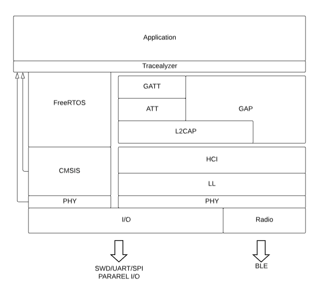

# Master's Thesis

## "Bezprzewodowy system sterowania z wykorzystaniem systemu czasu rzeczywistego FreeRTOS"  
` "Wireless control system using FreeRTOS" `

Master's thesis to obtain the degree Master of Science.
The project is composed with a three parts:
* ANALYSIS
* AQUISITION and CONTROL
* PROCESS

## Main Board
### HW

Main Booard is provided by nRF52832 (Nordic Semiconductor). The board is responsible for motor control, comunication with BLE server and advertising received value. Main Board will be equipped with ordinary user interface - buttons and LEDs.

### SW
Main Board SW Stack  

On main board instalated FreeRTOS stack, all tasks are controlled by scheluder. Only small amount of interrupts are permitted - for control clarity. As we can see from the picture - there is small buffer between Application and lower layers. Mentioned buffer is responsible for taking informations from all controller task and streaming those infos via serial interface to J-Link (the Information will be stored and presented on desktop by tracealyzer).

#### Program Design
The Application Core provided by FreRTOS, each task definition are included in header files, in specific folder for code clear. Bluetooth functionality should by implemented in library part too. Application code have to be located in the main.c - application layer uses the lower levels libraries. So for example, we want to initialize BLE server - in this case we must call the function with server initial arguments.

#### Percepio Tracealyzer

## Sensor Board

## Bibliography

* "Bluetooth Essentials for Programmers" - Albert S. Huang, Larry Rudolph | Massachusetts Institute of Technology

* "Getting Started with Bluetooth Low Energy: Tools and Techniques for Low-Power Networking" - Robert Davidson, Kevin Townsend, Chris Wang, Carles Cufí | ISBN 978-0-521-70375-8

* "Sensory i Systemy Pomiarowe" - Robert Czabanowski | ISBN 978-83-7493-559-3

* "Bluetooth Core Specification" - Bluetooth SIG Proprietary

* "Bluetooth 5.0 Specification" - Bluetooth SIG Proprietary
